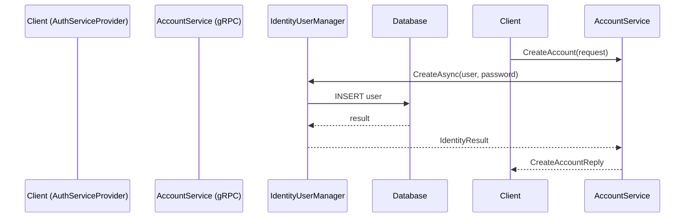

# AccountServiceProvider

En gRPC-baserad .NET-tjänst som hanterar konton, lösenord och e-postlogik för användare.

## Funktioner

- Skapa konto
- Validera inloggning
- Bekräfta konton och e-post
- Hämta eller uppdatera kontodata
- Generera återställningstokens

## Sekvensdiagram – Skapa konto



## Projektstruktur

```
Presentation/
├── Services/
├── Data/
├── Migrations/
├── Protos/
└── Program.cs
```

## Tester

Testprojektet använder:
- `xUnit`
- `Moq`
- `Grpc.Core.Testing`

### Testfall
- ✔️ Skapa konto
- ❌ Validera felaktigt lösenord
- ❌ Användare finns inte

##  Kom igång

```bash
dotnet restore
dotnet ef database update
dotnet run
```

## 📄 Protobuf

Se `Protos/account.proto` för detaljerad tjänstdefinition.
